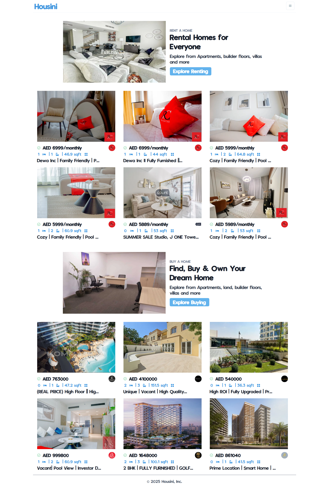

# 🏠 HOUSINI - REAL ESTATE



### 🌐 TRY IT LIVE  
👉 [Live on Vercel](https://housini.vercel.app/)  
Experience a clean and modern real estate web interface replica - visually engaging and fully responsive!

## 📖 Overview

Housini is a real estate frontend replica built with Next.js, Chakra UI, and React. This project mimics the core UI/UX of a professional real estate website, serving as both a learning project and a portfolio showcase. The app focuses on modern web practices, responsive design, and a smooth browsing experience.

## ✨ Features

- **Homepage Listings**: Clean grid layout showcasing property cards with images, descriptions, prices, and locations.
- **Detailed Property Pages**: Dedicated pages for each property with larger images, details, and contact options.
- **Search Functionality**: Instant search bar to filter properties by purpose (rent/sale), location, and price range.
- **Category Navigation**: Quickly browse rentals or properties for sale through intuitive navigation.
- **Custom Fonts**: Vanilla Extract font for an elegant look and consistent branding.
- **Responsive Design**: Fully responsive layout powered by Chakra UI Flexbox and Grid components.
- **Loading Indicators**: NProgress integration for smooth route transition loaders.
- **Modern Deployment**: Seamless deployment experience via Vercel.

## 🧰 Tech Stack

- **Framework**: Next.js (React)
- **Styling**: Chakra UI, Custom Fonts, CSS Modules
- **Font Integration**: CDN-based Vanilla Extract font
- **Routing**: Next.js dynamic routing with API-based data fetching
- **Deployment**: Vercel

## 🔧 Installation & Setup

1. Clone the repository:
    ```bash
    git clone https://github.com/aridepai17/housini.git
    cd housini
    ```

2. Install dependencies and run locally:
    ```bash
    npm install
    npm run dev
    ```

## 📁 Project Structure
```
housini/
├── assets/
├── components/
│ ├── Footer.jsx
│ ├── ImageScrollbar.jsx
│ ├── Layout.jsx
│ ├── Navbar.jsx
│ ├── Property.jsx
│ └── SearchFilters.jsx
├── finalpics/
│ ├── home.png
│ ├── rental.png
│ └── sale.png
├── pages/
│ ├── property/
│ │ └── [id].js
│ ├── _app.js
│ ├── index.js
│ └── search.js
├── public/
├── utils/
│ ├── fetchApi.js
│ ├── filterData.js
│ └── theme.js
├── .env.local
├── .gitignore
├── eslint.config.mjs
├── jsconfig.json
├── LICENSE
├── next.config.js
├── package-lock.json
├── package.json
├── postcss.config.js
└── README.md
```

## 🧠 How It Works

1. **Homepage**: Displays featured properties using a grid layout with category banners for Rent and Sale.
2. **Search Page**: Allows filtering properties via search parameters, dynamically fetching results.
3. **Dynamic Routing**: Property details fetched using Next.js dynamic routes.
4. **UI Design**: Chakra UI ensures smooth design responsiveness and prebuilt component usage.
5. **NProgress Loader**: Visual feedback during route changes for better user experience.

## 📜 License

This project is open-source and available under the [MIT License](LICENSE).

## 👨‍💻 Author

- **[aridepai17](https://github.com/aridepai17/)**

## 🙏 Acknowledgements

- Inspired by popular real estate websites like [Bayut](https://bayut.com) and [Zillow](https://www.zillow.com/)
- [Vercel](https://vercel.com/) for hassle-free deployment
- [Chakra UI](https://chakra-ui.com/) for rapid component development

---

*This project is a personal learning initiative and portfolio showcase. It is not affiliated with any real estate company or platform.*
